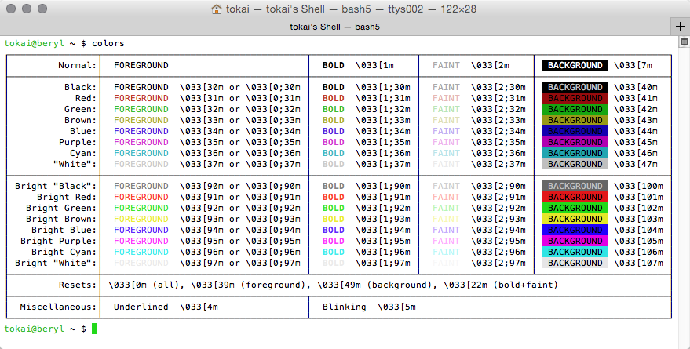

# Colors

**Colors** is a quick "in-Terminal" reference chart for the most important ANSI color escape sequences which can be used to control colors in the output of commandline tools.

## Installation

Copy `colors.sh` to `/usr/local/bin` or any other location that's accessible in your path (see `$PATH` environment variable). Alternatively rename it to just `colors`, or softlink, or alias it depending on your preference. It's just a simple shell script. No real installation necessary really.

## Screenshot

## Notes

* Quality of the output strongly depends on what the respective Terminal supports and how it is configured, e.g. with Mac OS X's `Terminal.app` multiple profile options change things (‘Use bold fonts’, ‘Display ANSI colors’, ‘Use bright colors for bold text’, ‘Allow blinking text’, the used font, etc.)
* Unicode (UTF-8) support is required for the box drawing characters. It will look better with some fonts than with others, e.g. ‘Menlo Regular’ works pretty well for me.

## Why?

I got tired of looking up random color IDs on the web, when I needed them. That's all. 😎
